<p align="center">
    <a href="https://dotnet.microsoft.com/en-us/apps/aspnet/signalr">
        
    </a>
</p>


# Demo SignalR 1

Một tiệm tạp hóa muốn theo dõi doanh thu của những sản phẩm đã bán theo từng loại và doanh thu từ các khách hàng theo ngày.

Khi có sự thay đổi trong cơ sở dữ liệu cục bộ, ứng dụng sẽ nhận được thông báo và cập nhật giao diện tương ứng.

## Các công cụ sử dụng 

- [Visual Studio 2022][1]
- [SQL Server 2022][0]
- SQL Server Management Studio 2019

## Hướng dẫn

### Bước 1

Cài đặt **ASP.NET and web development**  


### Bước 2

Tải và giải nén solution template mình đã chuẩn bị sẵn cho giao diện  
[template_demo_signalR_1.zip][2].

Nhấp đúp chuột vào file *demo_signalR_1.sln* để mở solution.  
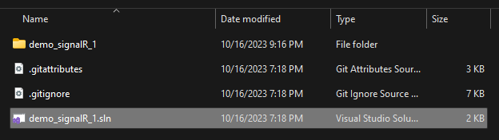

Thay đổi Startup project từ **IIS Express** thành **demo_signalR_1** để trong lúc chạy sẽ hiện ra một cửa sổ console (phục vụ việc theo dõi).  
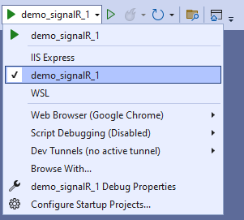

Nhấn **Ctrl + F5** hoặc nút **play** bên cạnh để chạy web.  
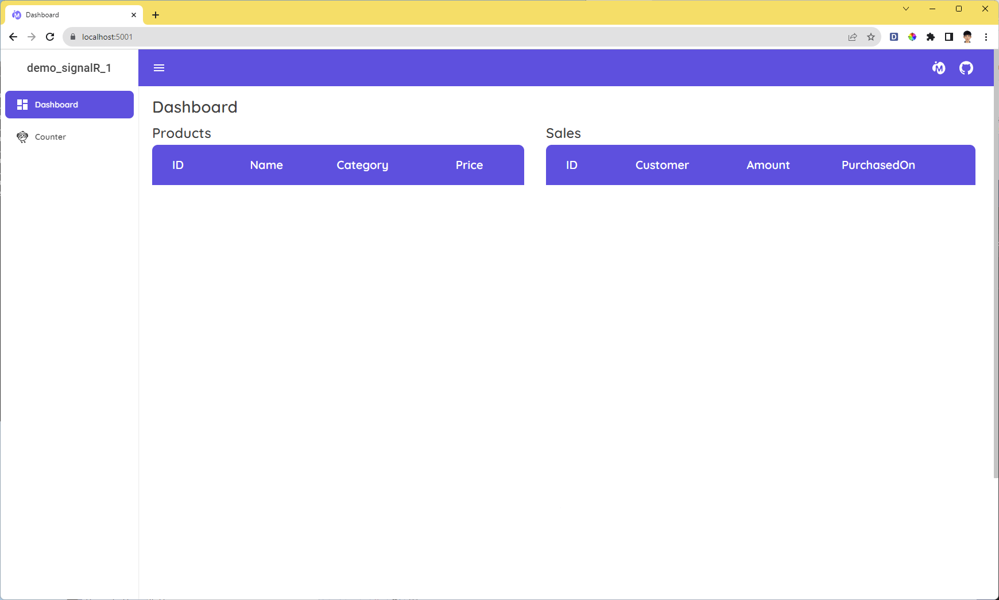

Cửa sổ console:  
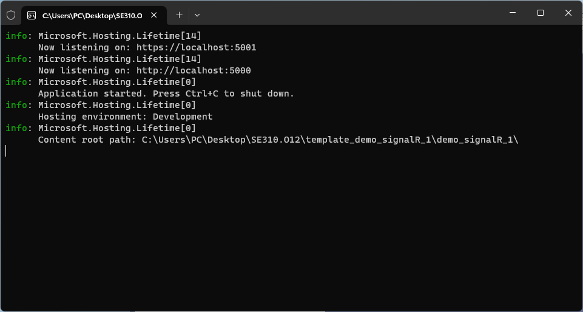

### Bước 3

Chạy script trong [demo_signalR_1.sql][3] để tạo cơ sơ dữ liệu

### Bước 4: Cài đặt Package

Trong Solution Explorer, mở *Nuget Package Manager* theo cách sau:  
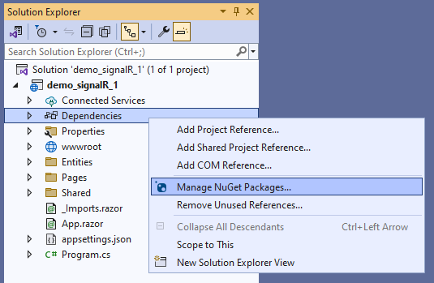

Tìm và cài đặt các gói sau:  
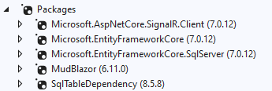

### Bước 5: Tạo connectionString

**Lấy Server name**  
Trong SSMS, tạo một truy vấn mới (Ctrl + N, New Query) và nhập

```
SELECT @@SERVERNAME
```

Nhấn **Execute** hoặc **F5** để thực thi và cho ra kết quả:  
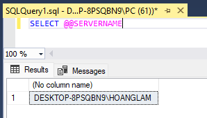

**Lấy ConnectionString**  
Trong Visual Stdio,  
Chọn **Tools**, sau đó chọn **Connect to Database…**  
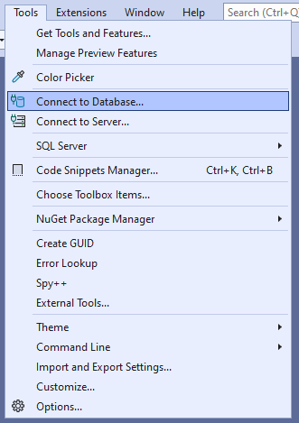

Điền **Server name** đã có ở trên  
Chọn database là *demo_signalR_1*  
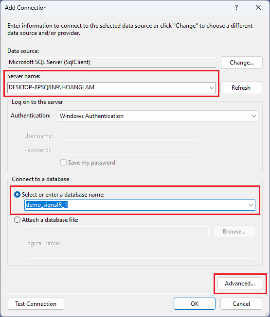

Chọn **Advanced...**  
Set giá trị **Trust Server Certificate** thành **True**  
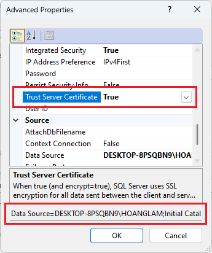

Sao chép toàn bộ chuỗi ở hàng cuối cùng, ta được connectionString tương tự như sau:  
Data Source=DESKTOP-8PSQBN9\HOANGLAM;Initial Catalog=demo_signalR_1;Integrated Security=True;TrustServerCertificate=True  
*(Lưu ý TrustServerCertificate viết liền không có khoảng trắng)*

### Bước 6: Kết nối database và hiển thị dữ liệu

Tạo class **AppDbContext** để giao tiếp với database.  
Data/AppDbContext.cs
```
public class AppDbContext: DbContext
{
	readonly string _connectionString = "Your connectionString";

	public DbSet<Product> Product { get; set; }
	public DbSet<Sale> Sale { get; set; }

	protected override void OnConfiguring(DbContextOptionsBuilder optionsBuilder)
	{
		optionsBuilder.UseSqlServer(_connectionString);
	}
}
```

Tạo class Service làm kho chứa các phương thức cho ứng dụng.  
Services/DashboardService.cs
```
public class DashboardService
{
    readonly AppDbContext _dbContext = new();

    public async Task<List<Product>> GetProducts()
    {
        return await _dbContext.Product.AsNoTracking().ToListAsync();
    }

    public async Task<List<Sale>> GetSales()
    {
        return await _dbContext.Sale.OrderBy(s => s.PurchasedOn).AsNoTracking().ToListAsync() ;
    }
}
```

Để Service được hoạt động,  
Trong Program.cs, ta thêm câu lệnh sau:
```
builder.Services.AddSingleton<DashboardService>();
```
**AddSingleton\<T\>** hình dung nôm na như là bạn tạo một biến kiểu T ở phạm vi global và có thể truy cập từ bất cứ đâu trong dự án.

Trong Pages/Index.razor,  
Khai báo namespace **Service** và một thể hiện của **DashboardService**.
```
@using demo_signalR_1.Services;
@inject DashboardService dashboardService;
```

Tiếp theo override phương thức OnInitializedAsync() để lấy dữ liệu từ database như sau:

```
protected override async Task OnInitializedAsync()
{
    products = await dashboardService.GetProducts();
    sales = await dashboardService.GetSales();

    Series = new List<ChartSeries>
    {
        new ChartSeries
        {
            Name = "Sales",
            Data = sales.GroupBy(s => s.PurchasedOn)
                        .Select(group => (double)group.Sum(s => s.Amount))
                        .ToArray(),
        },
    };

    XAxisLabels = sales.Select(s => s.PurchasedOn.ToString("dd/MM")).Distinct().ToArray();
}
```

Hoàn thành đầy đủ các bước trên và chạy ứng dụng ta có được kết quả như hình sau:  
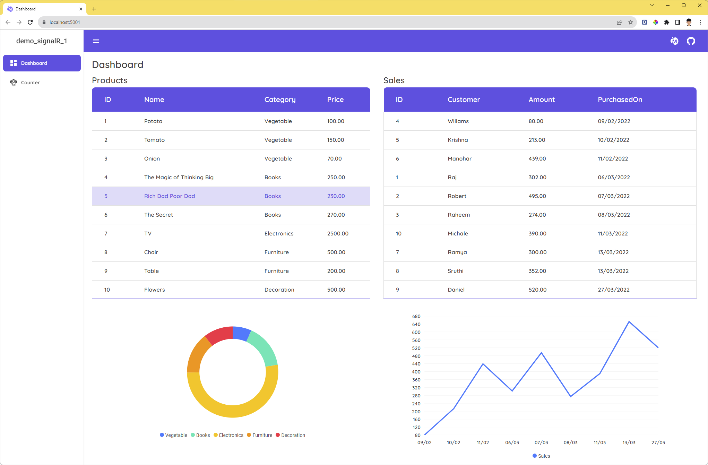

### Bước 7: SignalR Hub

**Tạo Hubs/DashboardHub**
```
public class DashboardHub : Hub
{
	public override Task OnConnectedAsync()
	{
		Console.WriteLine($"{Context.ConnectionId} has joined to Hub");
		return base.OnConnectedAsync();
	}

	public override Task OnDisconnectedAsync(Exception? exception)
	{
		Console.WriteLine($"{Context.ConnectionId} has left the Hub");
		return base.OnDisconnectedAsync(exception);
	}
}
```

**Kết nối những Client đang ở Index page vào Hub**

Trong Pages/Index.razor,  
Khai báo thư viện SignalR.Client và một DI trong Asp.net là NavigationManager.
```
@using Microsoft.AspNetCore.SignalR.Client;
@inject NavigationManager Navigation;
```

Trong ```@code{ ... }``` khai báo:
```
private HubConnection? hubConnection;
```

Tiếp theo, kết nối Client vào Hub bằng cách sau,
Trong phương thức OnInitializedAsync(), thêm:
```
hubConnection = new HubConnectionBuilder()
    .WithUrl(Navigation.ToAbsoluteUri("/dashboardHub"))
    .Build();

await hubConnection.StartAsync();
```
Nếu bạn gặp khó khăn, xem full code tại [Index.razor](demo_signalR_1/Pages/Index.razor).

Cuối cùng,  
Thêm thư viện SignalR và ánh xạ DashboardHub thành đường dẫn url trong Program.cs.
```
builder.Services.AddSignalR();
app.MapHub<DashboardHub>("/dashboardHub");
```

Chạy ứng dụng và mở cửa sổ console, ta được kết quả như sau:
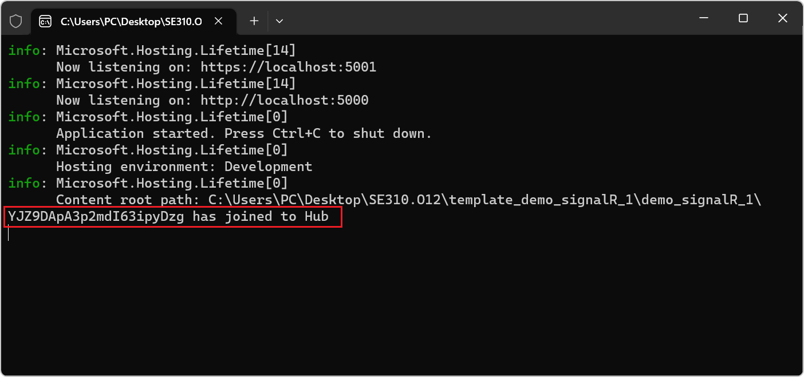

### Bước 8: Realtime với SignalR

Trong Services/DashboardService.cs, thêm các biến sau:
```
private readonly SqlTableDependency<Product> _productTableListener;
private readonly SqlTableDependency<Sale> _saleTableListener;

readonly string _connectionString = "Your connectionString";
private readonly IHubContext<DashboardHub> _context;
```
- SqlTableDependency\<T\> cho phép bạn lắng nghe sự thay đổi của table T trong cơ sở dữ liệu.
- IHubContext\<THub\> cho phép bạn chọn một Hub cụ thể để tương tác bằng cách truyền kiểu dữ liệu của Hub đó, cực kỳ tiện ích.

Thêm logic lắng nghe sự kiện từ cơ sở dữ liệu và gửi tin nhắn đến các client trong Hub.
```
public DashboardService(IHubContext<DashboardHub> context)
{
	_context = context;

	_productTableListener = new SqlTableDependency<Product>(_connectionString, "Product");
	_productTableListener.OnChanged += ProductChanged;
	_productTableListener.Start();

	_saleTableListener = new SqlTableDependency<Sale>(_connectionString, "Sale");
	_saleTableListener.OnChanged += SaleChanged;
	_saleTableListener.Start();
}

private async void ProductChanged(object sender, RecordChangedEventArgs<Product> e)
{
	List<Product> products = await GetProducts();
	await _context.Clients.All.SendAsync("RefreshProducts", products);
}

private async void SaleChanged(object sender, RecordChangedEventArgs<Sale> e)
{
	List<Sale> sales = await GetSales();
	await _context.Clients.All.SendAsync("RefreshSales", sales);
}
```
Giải thích:
- _productTableListener sẽ lắng nghe những thay đổi trong bảng Product và gửi thông báo đến tất cả các client đang kết nối vào Hub với thông điệp là “RefreshProducts” cùng dữ liệu mới của bảng Product.  
- Tương tự với _saleTableListener


Để những client nào nhận tin nhắn từ Hub, sẽ hiện thông báo lên màn hình và cập nhật giao diện tương ứng, ta làm như sau:  
Trong Index.razor,  
Khai báo Snackbar, một thể hiện của ISnackbar để hiện thông báo:
```
@inject ISnackbar Snackbar
```

Sau dòng lệnh khởi tạo hubConnection,  
Thêm logic xử lý như client nhận được thông báo từ Hub.
```
hubConnection.On<List<Product>>("RefreshProducts", newProducts =>
{
	this.products = newProducts;
	InvokeAsync(StateHasChanged);
	Snackbar.Add(
		"Product Table has changed", Severity.Success
	);

});

hubConnection.On<List<Sale>>("RefreshSales", newSales =>
{
	this.sales = newSales;
	XAxisLabels = sales.Select(s => s.PurchasedOn.ToString("dd/MM")).Distinct().ToArray();
	Series[0].Data = sales.GroupBy(s => s.PurchasedOn)
					.Select(group => (double)group.Sum(s => s.Amount))
					.ToArray();

	InvokeAsync(StateHasChanged);
	Snackbar.Add(
		"Sale Table has changed", Severity.Success
	);
});
```
Giải thích:  
- InvokeAsync(StateHasChanged): Thông báo cho Component rằng trạng thái của nó đã thay đổi. Khi áp dụng, điều này sẽ gây ra việc vẽ lại Component.
- Snackbar.Add(): Hiển thị thông báo lên màn hình với màu nền là màu xanh lá.

Nếu bạn gặp khó khăn, xem full code tại [Index.razor](demo_signalR_1/Pages/Index.razor).

Chạy ứng dụng và thử nghiệm.

### Bước 9: DisposeHubConnection

Ngắt kết nối với hub khi client rời khỏi trang Index.

Trong Pages/Index.razor,  
Triển khai interface IDisposable:
```
@implements IDisposable
```
```
public void Dispose()
{
    DisposeHubConnection();
}

private void DisposeHubConnection()
{
    if (hubConnection != null)
    {
        hubConnection.DisposeAsync();
        hubConnection = null;
    }
}
```

### END.

[0]: https://www.microsoft.com/en-us/sql-server
[1]: https://visualstudio.microsoft.com/
[2]: for_demo/template_demo_signalR_1.zip
[3]: script_db/demo_singalR_1.sql